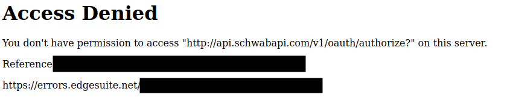

.. highlight:: python
.. py:module:: schwab.auth

.. _auth:

==================================
Authentication and Client Creation
==================================

By now, you should have followed the instructions in :ref:`getting_started` and 
are ready to start making API calls. Read this page to learn how to get over the 
last remaining hurdle: OAuth authentication.

Before we begin, however, note that this guide is meant to users who want to run 
applications on their own machines, without distributing them to others. If you 
plan on distributing your app, or if you plan on running it on a server and 
allowing access to other users, these login flows are not for you.

---------------
OAuth Refresher
---------------

*This section is purely for the curious. If you already understand OAuth (wow,
congrats) or if you don't care and just want to use this package as fast as
possible, feel free to skip this section. If you encounter any weird behavior, 
this section may help you understand what's going on.*

Webapp authentication is a complex beast. The OAuth protocol was created to 
allow applications to access one anothers' APIs securely and with the minimum 
level of trust possible. A full treatise on this topic is well beyond the scope
of this guide, but in order to alleviate some of the complexity that seems to 
surround this part of the API, let's give a quick explanation of how OAuth works 
in the context of Schwab's API.

The first thing to understand is that the OAuth webapp flow was created to allow 
client-side applications consisting of a webapp frontend and a remotely hosted 
backend to interact with a third party API. Unlike the `backend application flow
<https://requests-oauthlib.readthedocs.io/en/latest/oauth2_workflow.html
#backend-application-flow>`__, in which the remotely hosted backend has a secret 
which allows it to access the API on its own behalf, the webapp flow allows 
either the webapp frontend or the remotely host backend to access the API *on 
behalf of its users*.

If you've ever installed a GitHub, Facebook, Twitter, GMail, etc. app, you've 
seen this flow. You click on the "install" link, a login window pops up, you
enter your password, and you're presented with a page that asks whether you want 
to grant the app access to your account.

Here's what's happening under the hood. The window that pops up is the 
authentication URL, which opens a login page for the target API. The aim is to 
allow the user to input their username and password without the webapp frontend 
or the remotely hosted backend seeing it.  On web browsers, this is accomplished 
using the browser's refusal to send credentials from one domain to another.

Once login here is successful, the API replies with a redirect to a URL that the 
remotely hosted backend controls. This is the callback URL. This redirect will 
contain a code which securely identifies the user to the API, embedded in the 
query of the request.

You might think that code is enough to access the API, and it would be if the 
API author were willing to sacrifice long-term security. The exact reasons why 
it doesn't work involve some deep security topics like robustness against replay
attacks and session duration limitation, but we'll skip them here.

This code is useful only for fetching a token from the authentication endpoint.  
*This token* is what we want: a secure secret which the client can use to access 
API endpoints, and can be refreshed over time.

If you've gotten this far and your head isn't spinning, you haven't been paying 
attention. Security-sensitive protocols can be very complicated, and you should 
**never** build your own implementation. Fortunately there exist very robust 
implementations of this flow, and ``schwab-py``'s authentication module makes 
using them easy.

.. _login_flow:

--------------------------------------
Fetching a Token and Creating a Client
--------------------------------------

This function will guide you through the process of logging in and creating a 
token.

.. autofunction:: schwab.auth.client_from_login_flow

.. _manual_login:

If for some reason you cannot open a web browser, such as when running in a 
cloud environment, this function will guide you through the process of manually 
creating a token by copy-pasting relevant URLs.

.. autofunction:: schwab.auth.client_from_manual_flow

Once you have a token written on disk, you can reuse it without going through 
the login flow again. 

.. autofunction:: schwab.auth.client_from_token_file

The following is a convenient wrapper around token creation and fetching, 
calling each when appropriate:

.. autofunction:: schwab.auth.easy_client

If you don't want to create a client and just want to fetch a token, you can use
the ``schwab-generate-token.py`` script that's installed with the library. This 
method is particularly useful if you want to create your token on one machine 
and use it on another.

.. code-block:: bash

  usage: schwab-generate-token.py [-h] --token_file TOKEN_FILE --api_key API_KEY --app_secret APP_SECRET --callback_url CALLBACK_URL [--browser BROWSER]

  Fetch a new token and write it to a file

  options:
    -h, --help            show this help message and exit

  required arguments:
    --token_file TOKEN_FILE
                          Path to token file. Any existing file will be overwritten
    --api_key API_KEY
    --app_secret APP_SECRET
    --callback_url CALLBACK_URL
    --browser BROWSER     Manually specify a browser in which to start the login flow. See here for available options:
                          https://docs.python.org/3/library/webbrowser.html#webbrowser.register
    

This script is installed by ``pip``, and will only be accessible if you've added
pip's executable locations to your ``$PATH``. If you're having a hard time, feel
free to ask for help on our `Discord server <https://discord.gg/BEr6y6Xqyv>`__.

.. _token_expiration:

-------------------------
Notes on Token Expiration
-------------------------

Tokens are only good for seven days. Once seven days have passed since the token 
was originally created, you'll :ref:`see failures <invalid_client>` and will 
need to delete your old token file and create a new one.  In practice, this 
means most users will want to adopt some sort of proactive token refreshing 
method.  For instance, if you trade during the weekdays, you may want to delete 
and recreate your token on Sunday before the markets open. 

For users wanting to craft more custom workflows, the client :meth:`exposes the 
age of the token <schwab.client.Client.token_age>`. Note, however, that the 
seven day token age restriction is implemented by Schwab, and so the token may 
become expired sooner *or* later than seven days.

----------------------
Advanced Functionality
----------------------

The default token fetcher functions are designed for ease of use. They make some 
common assumptions, most notably a writable filesystem and a terminal that 
accepts inputs, which are valid for 99% of users. However, some very specialized 
users, for instance those hoping to deploy ``schwab-py`` in serverless settings, 
require some more advanced functionality.  This method provides the most 
flexible facility for fetching tokens possible. 

**Important:** This is an extremely advanced method. If you read the 
documentation and think anything other than "oh wow, this is exactly what I've 
been looking for," you don't need this function. Please use the other helpers 
instead.

.. autofunction:: schwab.auth.client_from_access_functions

++++++++++++++++++++++++++++++++++++++++
Technical Details about Token Refreshing
++++++++++++++++++++++++++++++++++++++++

This section is for readers who are curious about the technical details of token 
refreshing. If you just want to use the token, feel free to ignore it.

Under the hood, what the library and documentation calls a "token" is actually 
*two* tokens: an access token and a refresh token. Both tokens are randomly 
generated strings that are associated with your account, but they serve two 
different purposes. 

Access tokens are attached to each API request and are used to verify your 
identity to the API server. Requests with no token or invalid tokens are likely 
to be rejected. However, the access token is only valid for thirty minutes at a 
time. Requests associated with an access token older than thirty minutes are 
rejected. This is a security measure: if someone were to intercept your access 
token, they can only place requests as you for thirty minutes. 

In order to continue using the API after thirty minutes, we must request a new 
access token. This is where the refresh token comes into play: if you attempt to 
place an API call but ``schwab-py`` detects that your access token is expired 
(or about to expire), it will use the refresh token to request a new access 
token from Schwab. Once it receives the new access token, it will place your API 
request. This entire process is automatically managed and invisible to you.

This is where Schwab implements token expiration and other security measures: 
requests for a new access token using a refresh token older than seven days are 
rejected with an :ref:`invalid_client error<invalid_client>`. There is currently 
no way to make a refresh token last longer than seven days. Once you start 
seeing this error, you have no choice but to delete your old token file and 
create a new one.

---------------
Troubleshooting
---------------

As simple as it seems, the auth is complex and mistakes are easy to make.  This 
section outlines some of the more common issues you might encounter. If you find 
yourself dealing with something that isn't listed here, or if you try the 
suggested remedies and are still seeing issues, see the :ref:`help` page. You 
can also `join our Discord server <https://discord.gg/M3vjtHj>`__ to ask 
questions.

++++++++++++++++++++++++++++++++++++
Suspicious errors during signin flow
++++++++++++++++++++++++++++++++++++

All API endpoints require an approved app. When you app is first created and 
anytime it's modified, it will go into state ``Approved - Pending``, a
confusingly-named status indicating that the application is being manually 
approved by Schwab. Until that status changes to ``Ready for Use``, you cannot 
proceed using ``schwab-py``, and you will encounter difficult-to-debug errors. A 
listing of the types of errors people have reported:

 * ``401 Unauthorized`` errors in the signin flow
 * ``4001``, ``Session rejected``, or ``assertion_rejected`` payloads
 * ``Access Denied`` and ``You don't have permission to access 
   "http://api.schwabapi.com/v1/oauth/authorize?" on this server"``

Approval appears to be  a manual process, and most users have reported 
transitioning to the ``Ready for Use`` status within a few days. Please note 
this behavior is implemented on Schwab's side, so the library authors have no 
ability to influence this or speed up your approval time.

.. _ssl_errors:

+++++++++++++++++++++++++++++++++++++++++++++++++++++++
Browser Warnings About Invalid/Self-Signed Certificates
+++++++++++++++++++++++++++++++++++++++++++++++++++++++

:ref:`ssl_errors`

When creating a token using :func:`client_from_login_flow 
<schwab.auth.client_from_login_flow>`, you will likely encounter a warning from 
your browser about refusing to connect to a site using an invalid or self-signed 
certificate. Under the hood,
:func:`client_from_login_flow <schwab.auth.client_from_login_flow>` starts a 
server on your machine to listen for the OAuth callback. Since Schwab requires 
``https:`` callback URLs, this server must declare an SSL context. However, 
certificate authorities do not sign certificates for ``localhost`` or 
``127.0.0.1``, and so the server must self-sign the certificate. As this would 
be a security issue in any other context, your browser shows you a stern 
security warning.

It is safe to ignore this warning and proceed anyway. *However*, you should 
always verify that the address of the page displaying the warning matches your 
callback URL.  :func:`client_from_login_flow 
<schwab.auth.client_from_login_flow>` will print message reminding you of your 
callback URL each time you run it.

++++++++++++++++++++
``401 Unauthorized``
++++++++++++++++++++

This error is raised when ``schwab-py`` attempts to perform an operation using 
an invalid access token. If you don't know what that means, that's normal: you 
shouldn't see this error. Some users have reported seeing it, and the 
``schwab-py`` authors are working on updating the library to debug it. If you 
see this error, please share the stack trace in our `Discord server 
<https://discord.gg/Nq7AwrRV>`__. 

In the meantime, you can work around this bug by deleting your old token and 
creating a new one.

.. _invalid_client:

+++++++++++++++++++++++++++++++++++++++++++++++++++++
``OAuthError: invalid_client: refresh token invalid``
+++++++++++++++++++++++++++++++++++++++++++++++++++++

Tokens can only be refreshed for approximately seven days, at which point Schwab 
refuses to refresh your token and you need to recreate it. This error is thrown 
by the library in response to Schwab's refusal. :ref:`See here to learn about 
how tokens work. <token_expiration>`.

++++++++++++++++++++++
Token Parsing Failures
++++++++++++++++++++++

``schwab-py`` handles creating and refreshing tokens. Simply put, *the user 
should never create or modify the token file*. If you are experiencing parse 
errors when accessing the token file or getting exceptions when accessing it, 
it's probably because you created it yourself or modified it. If you're 
experiencing token parsing issues, remember that:

1. You should never create the token file yourself. If you don't already have a
   token, you should pass a nonexistent file path to 
   :func:`~schwab.auth.client_from_login_flow` or 
   :func:`~schwab.auth.easy_client`.  If the file already exists, these methods 
   assume it's a valid token file. If the file does not exist, they will go 
   through the login flow to create one.
2. You should never modify the token file. The token file is automatically 
   managed by ``schwab-py``, and modifying it will almost certainly break it.
3. You should never share the token file. If the token file is shared between 
   applications, one of them will beat the other to refreshing, locking the 
   slower one out of using ``schwab-py``.

If you didn't do any of this and are still seeing issues using a token file that 
you're confident is valid, please `file a ticket 
<https://github.com/alexgolec/schwab-py/issues>`__. Just remember, **never share 
your token file, not even with** ``schwab-py`` **developers**. Sharing the token
file is as dangerous as sharing your Schwab username and password.

++++++++++++++++++++++++++++++
What If I Can't Use a Browser?
++++++++++++++++++++++++++++++

Launching a browser can be inconvenient in some situations, most notably in
containerized applications running on a cloud provider, or when running in a 
notebook. ``schwab-py`` supports two alternatives to creating tokens by opening 
a web browser.

Firstly, the :ref:`manual login flow<manual_login>` flow allows you to go
through the login flow on a different machine than the one on which 
``schwab-py`` is running. Instead of starting the web browser and automatically 
opening the relevant URLs, this flow allows you to manually copy-paste around 
the URLs. It's a little more cumbersome, but it has no dependency on selenium.

Alterately, you can take advantage of the fact that token files are portable.
Once you create a token on one machine, such as one where you can open a web
browser, you can easily copy that token file to another machine, such as your
application in the cloud. However, make sure you don't use the same token on
two machines. It is recommended to delete the token created on the
browser-capable machine as soon as it is copied to its destination.
