.. _getting_started:

===============
Getting Started
===============

Welcome to ``schwab-py``! Read this page to learn how to install and configure 
your first Schwab Python application.

+++++++++++++++++++
Critical Schwab Bug
+++++++++++++++++++

As of July 21st, 2024, Schwab appears to be suffering from a breaking bug on the 
`developer console site <https://developer.schwab.com>`__ that is 
interfering with creating and managing apps. Don't let this warning prevent you 
from using this getting started guide, but if you experience any of the 
following errors, please email Schwab's API team at `traderapi@schwab.com 
<mailto:traderapi@schwab.com>`__ describing the issues you see. You can also 
join our `Discord server <https://discord.gg/mm44rstRCg>`__ to get updates.

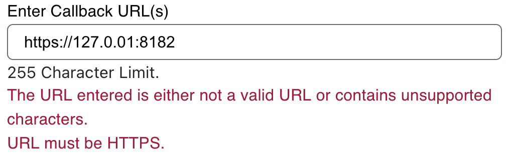

  When creating a new app, an error message warning about an invalid callback 
  URL or one warning about a non-HTTPS URL even though it's clearly HTTPS.

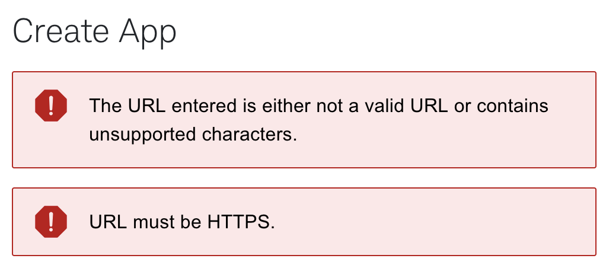

  After clicking the "Create" button when creating a new app, banners
  indicating the callback URL is invalid

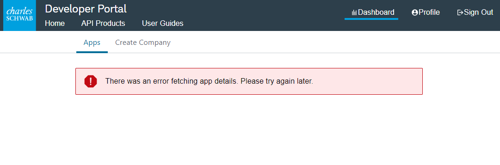

  When opening app details on an app, a banner reporting that app details 
  couldn't be fetched.

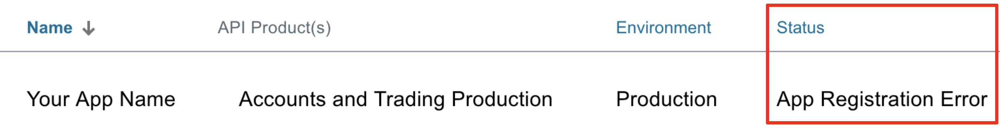

  After creating an app, a status of ``App Registration Error``

+++++++++++++++++
Schwab API Access
+++++++++++++++++

Before we do anything with ``schwab-py``, you'll need to create a developer 
account with Schwab and register an application. By the end of this section, 
you'll have accomplished the three prerequisites for using ``schwab-py``:

1. Create an application.
#. Choose and save the callback URL (important for authenticating).
#. Receive an app key and a secret.

**Create a Developer Account**

You can create a developer account `here 
<https://developer.schwab.com/>`__.  The instructions from here on out 
assume you're logged in, so make sure you log into the developer site after 
you've created your account.

**Create an Application**

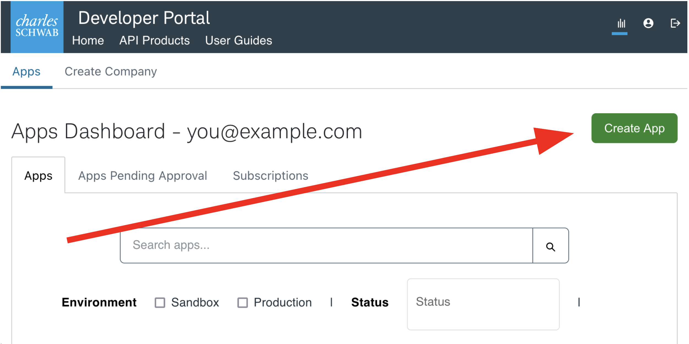

Next, you'll want to `create an application
<https://developer.schwab.com/dashboard/apps/apps/add>`__ and populate the 
required fields.

**API Product**

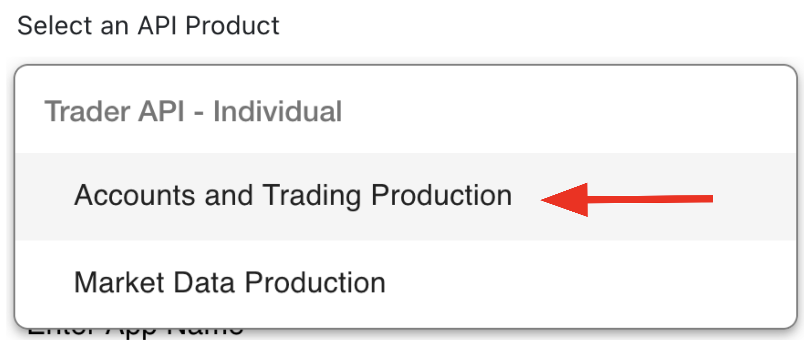

The first thing you'll select is the API Product. We in the community aren't 
currently clear on the difference between the options ("Accounts and Trading 
Production" and "Market Data"). It seems that selecting "Accounts and Trading 
Production" grants access to all APIs supported by ``schwab-py``, so unless you 
have a reason to do differently, we recommend selecting that option.

**Order Limit**

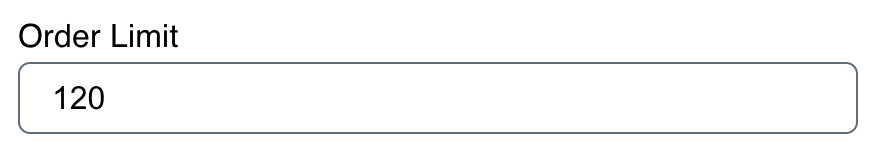

The order limit is the number of order-related requests your app will be 
permitted to place each minute. If you make, cancel, or replace more than this 
many orders each minute, you'll be throttled and your orders will be rejected.  
Most users have no reason to restrict this, so we recommend setting this to 120.

**App Name and Description**

.. figure:: _static/setting-up-name-and-description.png

Next are the app name and description. ``schwab-py`` does not use these values, 
but the folks at at Schwab might. We recommend being descriptive here, if only 
so that users and app approvers know what your app will do.

**App Name and Description**

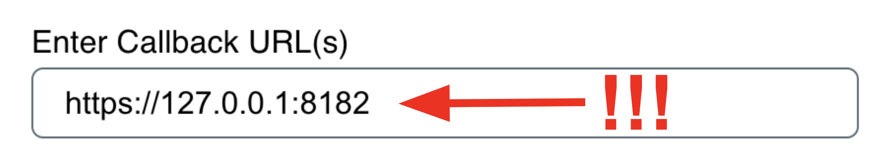

Finally, we have the callback URL. This one is important.  In a nutshell, the 
`OAuth login flow
<https://requests-oauthlib.readthedocs.io/en/
latest/oauth2_workflow.html#web-application-flow>`__ that Schwab uses works by 
opening a login page, securely collecting credentials on their domain, and then 
sending an HTTP request to the callback URL with ingredients for the token in 
the URL query.

The vast majority of users should set their callback URL to 
``https://127.0.0.1:8182`` (note the lack of a trailing slash). This means that 
once the login flow is completed, the generated credentials are sent back to 
your machine at port ``8182``, rather than any external server. Setting a port 
number is not require to use ``schwab-py``, but it is required to use 
:ref:`certain convenient features <login_flow>`.  Advanced users may be able to 
use a non-local callback URL, but this documentation assumes they are advanced 
enough not to need our help creating such a setup.

*Update July 21, 2024:* We are receiving intermittent reports that Schwab is 
refusing to create apps with callback URLs containing ``127.0.0.1``. If you 
encounter this, please let our Discord community know in our `help channel 
<https://discord.gg/mm44rstRCg>`__. If you don't have any problem, we still
encourage you to drop by anyway and tell us you were successful. It'll make
us feel better about this potential issue.

In any case, note that whatever callback URL you choose, you must pass it to 
``schwab-py`` *exactly* in the same way as you specified it while creating your 
app.  Any deviation (including adding or removing a trailing slash!) can cause 
difficult-to-debug issues. Be careful not to mis-copy this value.

.. _approved_pending:

**Waiting for Approval**

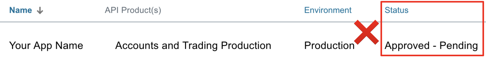

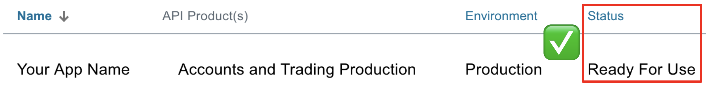

After your app is created, you will likely see it in an ``Approved - Pending`` 
state when you view it in your dashboard. Don't be fooled by the word 
``Approved``: your app is not yet ready for use. You must wait for Schwab to 
*actually* approve it, at which point its status will be ``Ready For Use.`` This 
can take up to a few days. Only then can you proceed to using ``schwab-py``.

**Client Secrets**

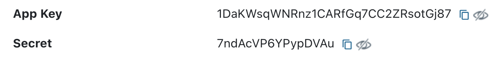

Once your app is created and approved, you will be able to access your app key
and app secret by clicking through to your approved application in the 
dashobard. Neither  of these are meant to be shared by anyone, so keep them safe 
(the ones displayed here are fake). You will also be required to pass these into 
``schwab-py``.  This library does not share these values with anyone except 
official Schwab endpoints, not even its authors. Don't share them with anyone.

++++++++++++++++++++++++
Installing ``schwab-py``
++++++++++++++++++++++++

This section outlines the installation process for client users. For developers, 
check out :ref:`contributing`.

The recommended method of installing ``schwab-py`` is using ``pip`` from
`PyPi <https://pypi.org/project/schwab-py/>`__ in a `virtualenv <https://
virtualenv.pypa.io/en/latest/>`__. First create a virtualenv in your project 
directory. Here we assume your virtualenv is called ``my-venv``:

.. code-block:: shell

  pip install virtualenv
  virtualenv -v my-venv
  source my-venv/bin/activate

You are now ready to install ``schwab-py``:

.. code-block:: shell

  pip install schwab-py

That's it! You're done! You can verify the install succeeded by importing the 
package:

.. code-block:: python

  import schwab

If this succeeded, you're ready to move on to :ref:`auth`.

Note that if you are using a virtual environment and switch to a new terminal
your virtual environment will not be active in the new terminal, and you need to 
run the activate command again. If you want to disable the loaded virtual 
environment in the same terminal window, use the command:

.. code-block:: shell

  deactivate

++++++++++++
Getting Help
++++++++++++

If you are ever stuck, feel free to  `join our Discord server
<https://discord.gg/M3vjtHj>`__ to ask questions, get advice, and chat with 
like-minded people. If you feel you've found a bug, you can :ref:`fill out a bug 
report <help>`.
